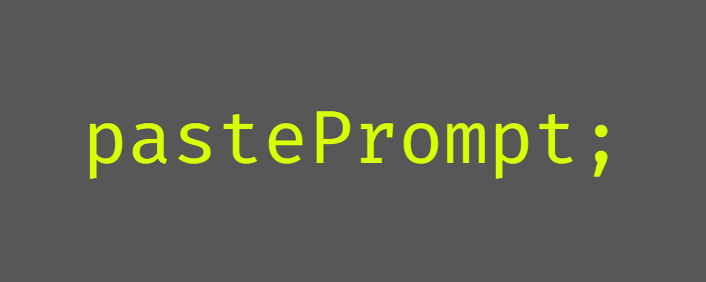

<!-- Improved compatibility of back to top link: See: https://github.com/othneildrew/Best-README-Template/pull/73 -->

<!--
*** Thanks for checking out the Best-README-Template. If you have a suggestion
*** that would make this better, please fork the repo and create a pull request
*** or simply open an issue with the tag "enhancement".
*** Don't forget to give the project a star!
*** Thanks again! Now go create something AMAZING! :D
-->

<!-- PROJECT SHIELDS -->
<!--
*** I'm using markdown "reference style" links for readability.
*** Reference links are enclosed in brackets [ ] instead of parentheses ( ).
*** See the bottom of this document for the declaration of the reference variables
*** for contributors-url, forks-url, etc. This is an optional, concise syntax you may use.
*** https://www.markdownguide.org/basic-syntax/#reference-style-links
-->

[![Contributors][contributors-shield]][contributors-url]
[![Forks][forks-shield]][forks-url]
[![Stargazers][stars-shield]][stars-url]
[![Issues][issues-shield]][issues-url]
[![MIT License][license-shield]][license-url]
[![LinkedIn][linkedin-shield]][linkedin-url]

<!-- PROJECT LOGO -->
 

  

  

    Hackathon Submission for <a href="https://ghw.mlh.io/">MLH Global Hack Week: Career Week 2024</a>
     
    <a href="https://github.com/silveralcid/pastePrompt">View Demo</a>
    ·
    <a href="https://github.com/silveralcid/pastePrompt/issues/new?labels=bug&template=bug-report---.md">Report Bug</a>
    ·
    <a href="https://github.com/silveralcid/pastePrompt/issues/new?labels=enhancement&template=feature-request---.md">Request Feature</a>
  

<!-- TABLE OF CONTENTS -->

  
Table of Contents

  <ol>
    <li><a href="#about-the-project">About The Project</a></li>
    <li><a href="#contributing">Contributing</a></li>
    <li><a href="#license">License</a></li>
    <li><a href="#contact">Contact</a></li>
  </ol>

<!-- ABOUT THE PROJECT -->

## About The Project

pastePrompt; is an extremely lightweight Chrome extension that streamlines AI research by letting you instantly prompt highlighted text in ChatGPT or Perplexity with a single keyboard shortcut. Save time with customizable prepended prompts - perfect for quick analysis, translations, or research tasks.

### Built With

- [![JavaScript][JavaScript]][JavaScript-url]

[![Product Name Screen Shot][product-screenshot]](https://github.com/silveralcid/pastePrompt)

(<a href="#readme-top">back to top</a>)

## Contributing

Contributions are what make the open source community such an amazing place to learn, inspire, and create. Any contributions you make are **greatly appreciated**.

If you have a suggestion that would make this better, please fork the repo and create a pull request. You can also simply open an issue with the tag "enhancement".
Don't forget to give the project a star! Thanks again!

1. Fork the Project
2. Create your Feature Branch (`git checkout -b feature/AmazingFeature`)
3. Commit your Changes (`git commit -m 'Add some AmazingFeature'`)
4. Push to the Branch (`git push origin feature/AmazingFeature`)
5. Open a Pull Request

(<a href="#readme-top">back to top</a>)

### Top contributors:

<!-- LICENSE -->

## License

Distributed under the MIT License. See `LICENSE.txt` for more information.

(<a href="#readme-top">back to top</a>)

<!-- CONTACT -->

## Contact

Silver Alcid - [@silveralcid](https://twitter.com/silveralcid) - silveralcid@outlook.com

Project Link: [https://github.com/silveralcid/pastePrompt](https://github.com/silveralcid/pastePrompt)

(<a href="#readme-top">back to top</a>)

<!-- MARKDOWN LINKS & IMAGES -->
<!-- https://www.markdownguide.org/basic-syntax/#reference-style-links -->

[contributors-shield]: https://img.shields.io/github/contributors/silveralcid/pastePrompt.svg?style=for-the-badge
[contributors-url]: https://github.com/silveralcid/pastePrompt/graphs/contributors
[forks-shield]: https://img.shields.io/github/forks/silveralcid/pastePrompt.svg?style=for-the-badge
[forks-url]: https://github.com/silveralcid/pastePrompt/network/members
[stars-shield]: https://img.shields.io/github/stars/silveralcid/pastePrompt.svg?style=for-the-badge
[stars-url]: https://github.com/silveralcid/pastePrompt/stargazers
[issues-shield]: https://img.shields.io/github/issues/silveralcid/pastePrompt.svg?style=for-the-badge
[issues-url]: https://github.com/silveralcid/pastePrompt/issues
[license-shield]: https://img.shields.io/github/license/silveralcid/pastePrompt.svg?style=for-the-badge
[license-url]: https://github.com/silveralcid/pastePrompt/blob/master/LICENSE.txt
[linkedin-shield]: https://img.shields.io/badge/-LinkedIn-black.svg?style=for-the-badge&logo=linkedin&colorB=555
[linkedin-url]: https://linkedin.com/in/silveralcid
[product-screenshot]: assets/screenshot.png
[JavaScript]: https://shields.io/badge/JavaScript-F7DF1E?logo=JavaScript&logoColor=000&style=flat-square
[JavaScript-url]: https://developer.mozilla.org/en-US/docs/Web/JavaScript
